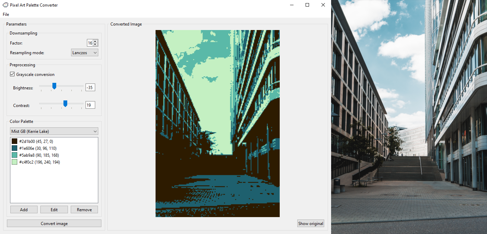

======================================================

**pixelart-palette-converter** is a simple Python GUI application for converting
images into [pixel art](https://en.wikipedia.org/wiki/Pixel_art) style with a fixed
color palette.

Example
-------


Example of an image conversion using a downsampling factor of 16 with **Pillow**'s
[Lanczos](https://pillow.readthedocs.io/en/stable/handbook/concepts.html#PIL.Image.Resampling.LANCZOS)
resampling mode, grayscale conversion, brightness/contrast adjustments, and a four-color
palette by [Kerrie Lake](https://lospec.com/palette-list/mist-gb). (Photo by me)

Installation
------------
1. Download and install **git** on your system: https://git-scm.com/downloads.
2. Download and install the latest version of **Python**: https://www.python.org/downloads/.
3. Clone this repository with:
    ```sh
    git clone https://github.com/jmittendo/pixelart-palette-converter
    ```
4. Create a [virtual environment](https://docs.python.org/3/library/venv.html):
    ```sh
    python -m venv .venv
    ```
5. Activate the environment:
    * Windows:
        ```sh
        .venv\Scripts\activate
        ```
    * Linux:
        ```sh
        source .venv/bin/activate
        ```
6. Upgrade **pip** inside the environment:
    ```sh
    python -m pip install -U pip
    ```
7. Install the required packages inside the environment:
    ```sh
    pip install -r requirements.txt
    ```

Usage
-----
After [installing](#installation), activate the virtual environment if necessary (check
installation step 5) and run the application with:
```sh
    python pixelart_palette_converter.py
```